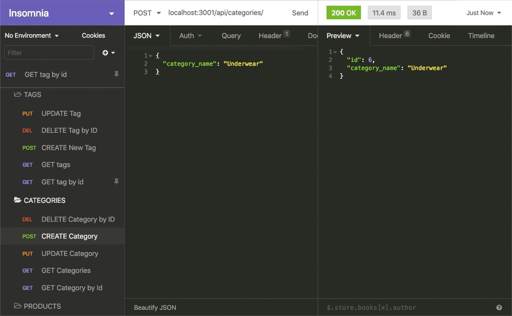

# E-commerce Back End Starter Code
E-commerce Back End Starter Code
This repository provides a basic foundation for building an e-commerce back-end application using Node.js, Express, and Sequelize.

Features
Express framework: Provides a robust and flexible foundation for building APIs.
Sequelize ORM: Simplifies database interactions with PostgreSQL.
Included models: Pre-defined models for products, categories, tags, and product-tag relationships.
API Endpoints (not included): This starter code focuses on database setup and doesn't include pre-built API endpoints. You'll need to implement the logic for CRUD (Create, Read, Update, Delete) operations on your models to build a functional API.
Prerequisites
Node.js and npm (Node Package Manager) installed on your system.
A PostgreSQL database server.
Getting Started
Clone the repository:

Bash
git clone 
Use code with caution.
content_copy
Install dependencies:

Bash
cd e-commerce-backend
npm install
Use code with caution.
content_copy
Configure database connection:

Create a .env file in the project root directory (ignore this file with Git).

Add your PostgreSQL database credentials to the .env file:

DB_NAME=your_database_name
DB_USER=your_username
DB_PASSWORD=your_password
DB_HOST=your_database_host (optional, defaults to localhost)
DB_PORT=your_database_port (optional, defaults to 5432)
Start the server:

Bash
npm start
Use code with caution.
content_copy
This will start the server and attempt to connect to your PostgreSQL database.

Using the Code
This starter code provides the basic building blocks for your e-commerce application. You'll need to implement the API endpoints specific to your needs, such as:

CRUD operations for products, categories, and tags.
User authentication and authorization (optional).
Shopping cart functionality (optional).
Order processing (optional).
Feel free to customize and extend this code base to build your e-commerce back-end application.

Additional Notes
Refer to the Express and Sequelize documentation for more details on using these libraries.
Consider using environment variables to store sensitive information like database credentials.
Implement error handling and logging for a robust application.
This README provides a basic guide to get you started. Feel free to explore the code further and customize it for your specific requirements.

